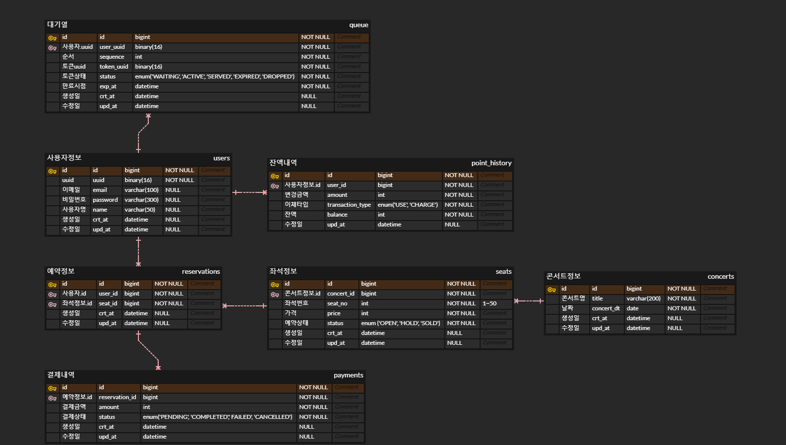

## ERD 다이어그램
 

## 테이블 목록

| 테이블명          | 테이블 설명   |
|---------------|----------|
| queue         | 대기열토큰 정보 |
| users         | 사용자정보    |
| point_history | 포인트 정보   |
| reservations  | 예약 정보    |
| seats         | 좌석 정보    |
| concerts      | 콘서트정보    |
| payments      | 결제 내역    |

## 테이블 정의서
**1. queue - 대기열토큰 정보**

- 테이블구조

| Column     | Type       | Key             | NULL     | 설명                  |
|------------|------------|-----------------|----------|---------------------|
| id         | BIGINT     | PK              | NOT NULL | id (AUTO_INCREMENT) |
| users_uuid | BINARY(16) | FK (users.uuid) | NOT NULL | 사용자 uuid            |
| sequence   | INT        |                 | NOT NULL | 토큰발급 순서             |
| token_uuid | BINARY(16) |                 | NOT NULL | 토큰 uuid             |
| status     | ENUM       |                 | NOT NULL | 토큰 상태               |
| exp_at     | DATETIME   |                 | NOT NULL | 토큰 만료시점             |
| crt_at     | DATETIME   |                 | NULL     | 생성일                 |
| upd_dt     | DATETIME   |                 | NULL     | 수정일                 |

- status - enum 목록

| 값       | 설명                       |
|---------|--------------------------|
| WAITING | 대기열 진입하여 토큰발급 대기중        |
| ACTIVE  | 토큰발급 -> 예약가능상태           |
| SERVED  | 토큰 정상소비                  |
| EXPIRED | 토큰만료                     |
| DROPPED | 사용자이탈/중복토큰발행 등으로 토큰 강제취소 |

- 생성문
```sql
CREATE TABLE queue (
  id BIGINT PRIMARY KEY AUTO_INCREMENT,
  users_uuid BINARY(16) NOT NULL,           
  sequence INT NOT NULL,
  token_uuid BINARY(16) NOT NULL,
  status ENUM('WAITING','ACTIVE','SERVED','EXPIRED','DROPPED') NOT NULL DEFAULT 'WAITING',
  exp_at DATETIME DEFAULT CURRENT_TIMESTAMP,
  crt_at DATETIME DEFAULT CURRENT_TIMESTAMP,
  upd_at DATETIME DEFAULT CURRENT_TIMESTAMP ON UPDATE CURRENT_TIMESTAMP,
  CONSTRAINT FOREIGN KEY (user_uuid) REFERENCES users(uuid)
)
```

**2. users - 사용자 정보**
- 테이블구조

| Column   | Type         | Constraints | NULL     | 설명                  |
|----------|--------------|-------------|----------|---------------------|
| id       | BIGINT       | PK          | NOT NULL | id (AUTO_INCREMENT) |
| uuid     | BINARY(16)   | UK          | NOT NULL | 사용자 uuid            |
| email    | VARCHAR(100) | UK          | NULL     | 이메일                 |
| password | VARCHAR(300) |             | NULL     | 비밀번호                |
| name     | VARCHAR(50)  |             | NULL     | 사용자명                |
| crt_at   | DATETIME     |             | NULL     | 생성일                 |
| upd_at   | DATETIME     |             | NULL     | 수정일                 |

- 생성문
```sql
CREATE TABLE users (
  id BIGINT PRIMARY KEY AUTO_INCREMENT,
  uuid BINARY(16) NOT NULL UNIQUE,           
  email VARCHAR(100) UNIQUE,
  password VARCHAR(300),
  name VARCHAR(50),
  crt_at DATETIME DEFAULT CURRENT_TIMESTAMP,
  upd_at DATETIME DEFAULT CURRENT_TIMESTAMP ON UPDATE CURRENT_TIMESTAMP
)
```

**3. point_histoty - 포인트 정보**
- 테이블구조

| Column           | Type     | Key           | NULL     | 설명                  |
|------------------|----------|---------------|----------|---------------------|
| id               | BIGINT   | PK            | NOT NULL | id (AUTO_INCREMENT) |
| user_id          | BIGINT   | FK (users.id) | NOT NULL | 사용자정보.id 참조         |
| amount           | INT      |               | NOT NULL | 변경 금액               |
| transaction_type | ENUM     |               | NOT NULL | 이체 타입               |
| balance          | INT      |               | NOT NULL | 변경후 잔액              |
| upd_at           | DATETIME |               | NULL     | 수정일                 |

- transaction_type - enum 목록

| 값      | 설명     |
|--------|--------|
| USE    | 포인트 사용 |
| CHARGE | 포인트 충전 |

- 생성문
```sql
CREATE TABLE point_history (
  id BIGINT PRIMARY KEY AUTO_INCREMENT,
  user_id BIGINT NOT NULL,
  amount INT NOT NULL,
  transaction_type ENUM('USE','CHARGE') NOT NULL,
  balance INT NOT NULL,
  upd_at DATETIME DEFAULT CURRENT_TIMESTAMP ON UPDATE CURRENT_TIMESTAMP,
  CONSTRAINT FOREIGN KEY (user_id) REFERENCES users(id)
)
```

**4. reservations - 예약 정보**
- 테이블 구조

| Column  | Type     | Key           | NULL     | 설명                  |
|---------|----------|---------------|----------|---------------------|
| id      | BIGINT   | PK            | NOT NULL | id (AUTO_INCREMENT) |
| user_id | BIGINT   | FK (users.id) | NOT NULL | 사용자.id 참조           |
| seat_id | BIGINT   | FK (seats.id) | NOT NULL | 좌석정보.id 참조          |
| crt_at  | DATETIME |               | NULL     | 생성일                 |
| upd_at  | DATETIME |               | NULL     | 수정일                 |

- 생성문
```sql
CREATE TABLE reservations (
 id BIGINT PRIMARY KEY AUTO_INCREMENT,
  user_id BIGINT NOT NULL,
  seat_id BIGINT NOT NULL,
  crt_at DATETIME DEFAULT CURRENT_TIMESTAMP,
  upd_at DATETIME DEFAULT CURRENT_TIMESTAMP ON UPDATE CURRENT_TIMESTAMP,
  CONSTRAINT FOREIGN KEY (user_id) REFERENCES users(id),
  CONSTRAINT FOREIGN KEY (seat_id) REFERENCES seats(id)
)
```

**5. seats - 좌석 정보**
- 테이블 구조

| Column     | Type     | Key | NULL     | 설명                  |
|------------|----------|-----|----------|---------------------|
| id         | BIGINT   | PK  | NOT NULL | id (AUTO_INCREMENT) |
| concert_id | BIGINT   | FK  | NOT NULL | 콘서트정보.id 참조         |
| seat_no    | INT      |     | NOT NULL | 좌석번호                |
| price      | INT      |     | NOT NULL | 가격                  |
| status     | ENUM     |     | NOT NULL | 예약상태                |
| crt_at     | DATETIME |     | NULL     | 생성일                 |
| upd_at     | DATETIME |     | NULL     | 수정일                 |

- status - enum 목록

| 값    | 설명    |
|------|-------|
| OPEN | 예약가능  |
| HOLD | 예약진행중 |
| SOLD | 예약완료  |

- 생성문
```sql
CREATE TABLE seats (
  id BIGINT PRIMARY KEY AUTO_INCREMENT,
  concert_id BIGINT NOT NULL,
  seat_no INT NOT NULL,
  price INT NOT NULL,
  status ENUM('OPEN','HOLD','SOLD') NOT NULL DEFAULT 'OPEN',
  crt_at DATETIME DEFAULT CURRENT_TIMESTAMP,
  upd_at DATETIME DEFAULT CURRENT_TIMESTAMP ON UPDATE CURRENT_TIMESTAMP,
  CONSTRAINT FOREIGN KEY (concert_id) REFERENCES concerts(id)
)
```

**6. concerts - 콘서트 정보**
- 테이블 구조

| Column     | Type         | Key | NULL     | 설명                  |
|------------|--------------|-----|----------|---------------------|
| id         | BIGINT       | PK  | NOT NULL | id (AUTO_INCREMENT) |
| title      | VARCHAR(200) |     | NOT NULL | 콘서트명                |
| concert_dt | DATE         |     | NOT NULL | 콘서트 날짜              |
| crt_at     | DATETIME     |     | NULL     | 생성일                 |
| upd_at     | DATETIME     |     | NULL     | 수정일                 |

- 생성문
```sql
CREATE TABLE concerts (
  id BIGINT PRIMARY KEY AUTO_INCREMENT,
  title VARCHAR(200) NOT NULL,
  concert_dt DATE NOT NULL,
  crt_at DATETIME DEFAULT CURRENT_TIMESTAMP,
  upd_at DATETIME DEFAULT CURRENT_TIMESTAMP ON UPDATE CURRENT_TIMESTAMP
)
```

**7. payments - 결제 내역**
- 테이블 구조

| Column         | Type     | Key                  | NULL     | 설명                  |
|----------------|----------|----------------------|----------|---------------------|
| id             | BIGINT   | PK                   | NOT NULL | id (AUTO_INCREMENT) |
| reservation_id | BIGINT   | FK (reservations.id) | NOT NULL | 예약정보.id 참조          |
| amount         | INT      |                      | NOT NULL | 결제금액                |
| status         | ENUM     |                      | NOT NULL | 결제상태                |
| crt_at         | DATETIME |                      | NULL     | 생성일                 |
| upd_at         | DATETIME |                      | NULL     | 수정일                 |

- status - enum 목록

| 값         | 설명                    |
|-----------|-----------------------|
| PENDING   | 결제진행중, 포인트차감 트랜잭션 진행중 |
| COMPLETED | 결제완료, 포인트차감 트랜잭션 완료   |
| FAILED    | 결제 실패                 |
| CANCELLED | 결제 취소                 |

- 생성문
```sql
CREATE TABLE payments (
  id BIGINT PRIMARY KEY AUTO_INCREMENT,
  reservation_id BIGINT NOT NULL,
  amount INT NOT NULL,
  status ENUM('PENDING','COMPLETED','FAILED','CANCELLED') NOT NULL DEFAULT 'PENDING',
  crt_at DATETIME DEFAULT CURRENT_TIMESTAMP,
  upd_at DATETIME DEFAULT CURRENT_TIMESTAMP ON UPDATE CURRENT_TIMESTAMP,
  CONSTRAINT FOREIGN KEY (reservation_id) REFERENCES reservations(id)
)
```
