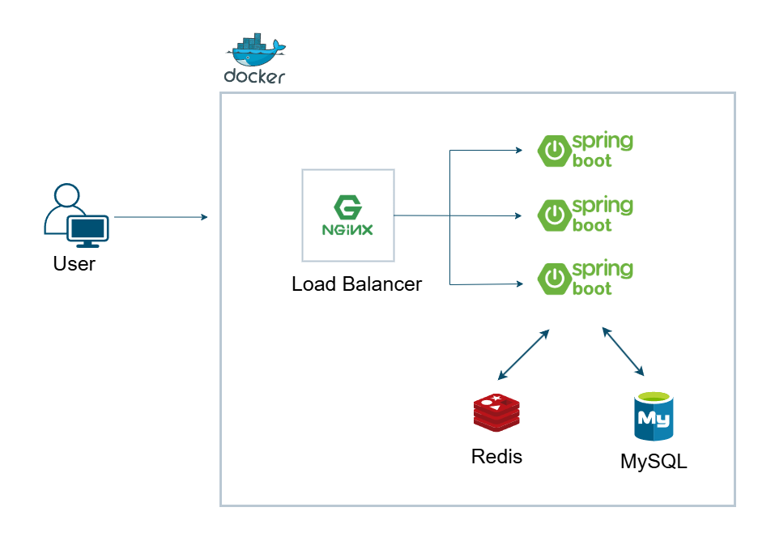

## 인프라구성도

## Docker
- Nginx, Spring Boot, Redis, MySQL 모두 컨테이너에 담아 배포합니다.

## NginX
- 로드밸런서
- 클라이언트 요청을 여러개의 Spring Boot 인스턴스로 분산처리합니다.
- 확장성, 고가용성을 확보할 수 있습니다.

## Spring Boot
- 다중 인스턴스로 구성되어 트래픽을 병렬적으로 처리합니다.

## Redis
- 인메모리 데이터 스토어
- 캐시 및 세선관리, 대기열 토큰관리등의 기능을 합니다.

## MySQL
- RDBMS
